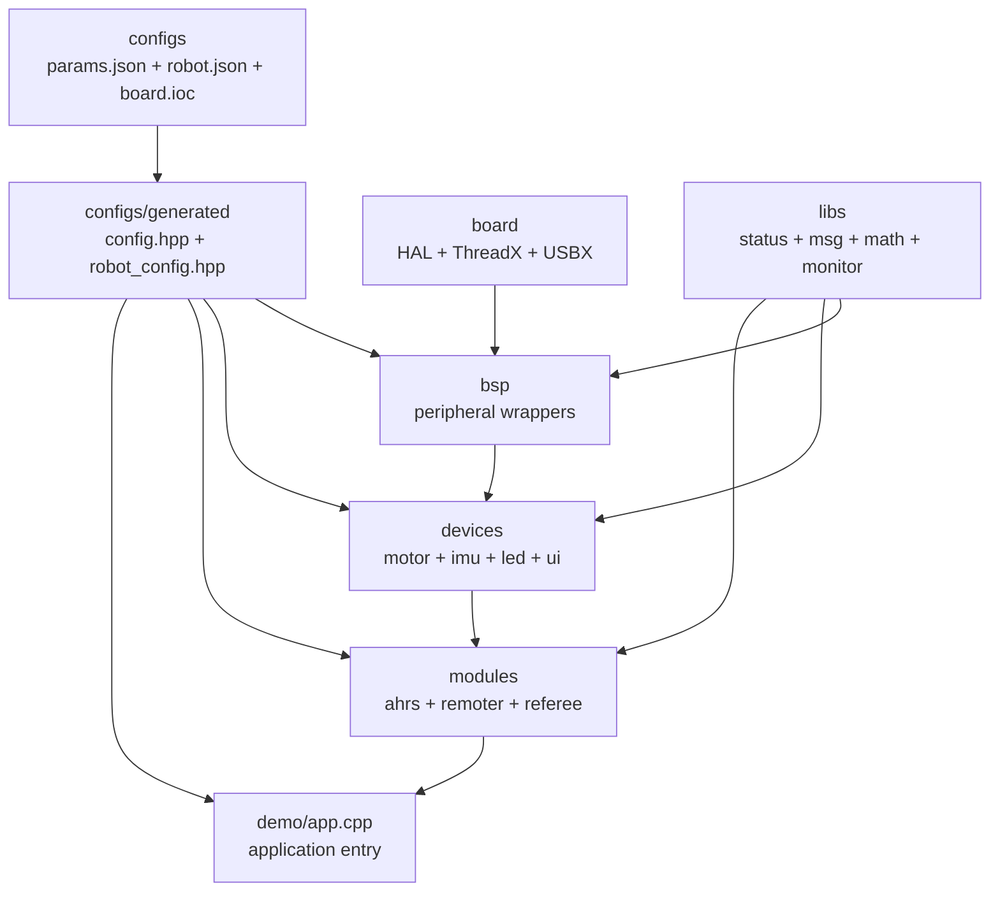

# embedded_framework

`embedded_framework` 是��RoboMaster 类机器人�制�的 STM32H723 固件框�。工程以 STM32CubeMX 生��HAL/ThreadX/USBX 工程为硬件基础，在其上�供�置驱动�BSP�设备抽象���用业务模��通用库和�端 demo�

当�工程目标�是把所有能力�装���平�，而是让硬件绑定�设备�例和�务线程尽�由�置�述，�CMake 在�置阶段生��读头文件；业务代���赖稳定��和生�出的绑定常��

## 目录结�

| 目录 | �责 |
| --- | --- |
| `boards/stm32h723/` | STM32CubeMX/HAL/ThreadX/USBX 生�工程��动文件�链�脚本和工具链文件�|
| `configs/` | `params.json`�`robot.json`�IOC 解��`config.hpp`/`robot_config.hpp` 生�逻辑�|
| `bsp/stm32h723/` | CAN�USART�SPI�PWM�DWT�EXTI�Flash�USB 等�级外设�装�|
| `devices/` | 电机�IMU�LED�UI 等基�BSP 的具体设备�统一���|
| `modules/` | AHRS���器��判系统等��续�行的�务线程�|
| `libs/` | 状���消��CRC��制�滤波�数学和�行时监�等通用能力�|
| `demo/` | �端�调入��具�demo 和主机侧验�脚本�|
| `cmsis-dsp/` | �工程纳入的 CMSIS-DSP �集，供 AHRS/EKF 等算法使用�|

## 分层关系



�赖方�����：上层�直��作 HAL �柄，硬件资�通过 `bsp` 暴露；设备层统一相似硬件能力；模�层负责�务线程和消��布；`demo/app.cpp` 是当�应用装�入��

## �建

�`embedded_framework/` 目录内，��使用工程自带 preset 或显�指�ARM 工具链：

```powershell
cmake --preset Debug
cmake --build --preset Debug
```

也�以指定独立�建目录：

```powershell
cmake -S embedded_framework -B .agents\build\embedded_framework_arm -G Ninja -DCMAKE_TOOLCHAIN_FILE=boards/stm32h723/cmake/gcc-arm-none-eabi.cmake
cmake --build .agents\build\embedded_framework_arm
```

�建�置阶段会读�：

- `boards/stm32h723/board.ioc`
- `configs/params.json`
- `configs/robot.json`
- `configs/cmake/generate_config.cmake`

并生�：

- `configs/generated/config.hpp`
- `configs/generated/robot_config.hpp`

生�文件�CMake 管�，业务修改应�到 JSON �IOC，而�是手�generated 目录�

## 入�

ThreadX �始化阶段会�`boards/stm32h723/Core/Src/app_threadx.c` 调用�

```cpp
extern "C" void app_start();
```

当����� `demo/app.cpp`，通过打开对应 `demo::<name>::run()` �`demo::<name>::start()` 选择�端�调入�。�续正�机器人应用也应�这里完��务�始化和设备装��

## 开�约�

- 优先扩展�有层次：�置放 `configs`，外设�装放 `bsp`，硬件对象放 `devices`，�续�行的通用�务�`modules`，纯工具能力�`libs`�
- 新�抽象必须承担真��责，例如�议隔离�类�安全�并�边界或�用；��新��转�一次的薄�装�
- BSP 公共��优先返� `types::status`，并���HAL 状���柄和中断细节泄�给上层�
- 通信�收优先使用注册�调�信���`msg` topic，�在模�内部�有化输出通��
- �端调试优先暴露 telemetry/debug state，demo 中����`printf`�
- 修改 `params.json`�`robot.json` �`board.ioc` ���configure/build，确�生�头文件�步�
